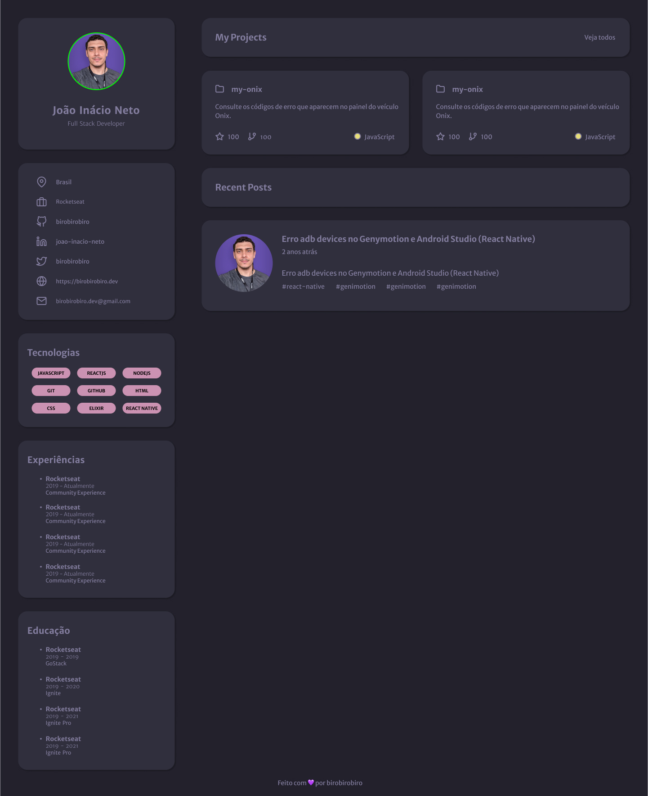

<h1 align="center"> Projeto Portfólio </h1>

Desafio feito na página da Rockeatseat, totalmente gratuito. 

  

 

## 🚀 Tecnologias

Esse projeto foi desenvolvido com as seguintes tecnologias:

- HTML e CSS
- Git e Github
- Figma

## 💻 Projeto

- [Acesse o projeto finalizado, online](https://devmiguez.github.io/desafio-portfolio)

## 📚 O que eu achei e aprendi?

Esse desafio foi muito bom para treino de flexbox!! Porém usei um pouco de css grid tambem!! Gostei muito de fazer, sem muita dificuldade ;).

 
